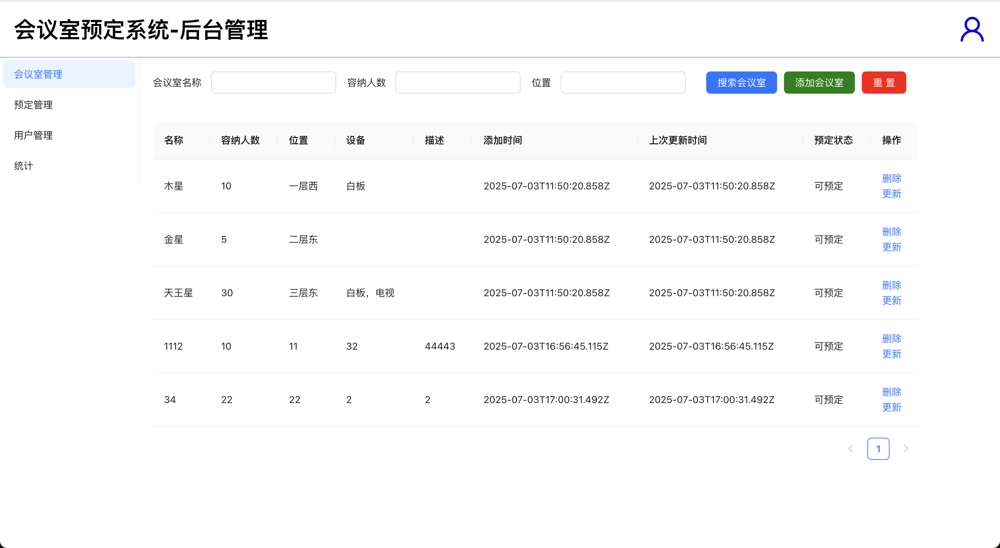

# 会议室预订系统 - 管理端前端

一个基于 React + TypeScript + Ant Design 的会议室预订系统管理端，提供完整的会议室管理、预订管理、用户管理和数据统计功能。



## ✨ 特性

- 🏢 **会议室管理** - 创建、编辑、删除会议室信息
- 📅 **预订管理** - 审批、拒绝、解除会议室预订申请
- 👥 **用户管理** - 查看、搜索、冻结用户账户
- 📊 **数据统计** - 会议室使用率和用户预订数据可视化
- 🔐 **权限控制** - 管理员登录认证和token自动刷新
- 📱 **响应式设计** - 适配不同屏幕尺寸的现代化UI界面

## 🛠 技术栈

- **前端框架**: React 18.3.1
- **开发语言**: TypeScript 4.9.5  
- **UI组件库**: Ant Design 5.26.3
- **路由管理**: React Router DOM 6.23.0
- **HTTP客户端**: Axios 1.10.0
- **图表库**: ECharts 5.6.0
- **构建工具**: Create React App 5.0.1

## 📦 安装

### 环境要求

- Node.js >= 16.0.0
- npm 或 yarn

### 安装依赖

```bash
# 使用 npm
npm install

# 或使用 yarn
yarn install
```

## 🚀 快速开始

### 启动开发服务器

```bash
npm start
```

应用将在 `http://localhost:3000` 启动

### 构建生产版本

```bash
npm run build
```

构建文件将输出到 `build` 文件夹

### 运行测试

```bash
npm test
```

## 🔧 配置

### 后端API配置

后端API地址配置在 `src/interfaces/interfaces.ts` 文件中：

```typescript
const axiosInstance = axios.create({
  baseURL: 'http://localhost:3005/',  // 修改为你的后端API地址
  timeout: 3000,
})
```

## 📋 功能模块

### 1. 登录认证
- 管理员账户登录
- JWT Token 自动刷新
- 登录状态持久化

### 2. 会议室管理
- **查看会议室列表** - 分页展示所有会议室信息
- **搜索过滤** - 按名称、容量、设备进行筛选
- **创建会议室** - 添加新的会议室
- **编辑会议室** - 修改会议室信息
- **删除会议室** - 移除不需要的会议室
- **预订状态** - 实时显示会议室预订状态

### 3. 预订管理
- **预订申请列表** - 查看所有预订申请
- **审批操作** - 通过/拒绝预订申请
- **解除预订** - 取消已确认的预订
- **搜索筛选** - 按预订人、会议室、时间等条件筛选
- **状态过滤** - 按审批状态筛选申请

### 4. 用户管理
- **用户列表** - 查看所有注册用户
- **用户搜索** - 按用户名、昵称、邮箱搜索
- **冻结用户** - 禁用违规用户账户
- **用户信息** - 查看用户详细信息和头像

### 5. 数据统计
- **会议室使用统计** - 可视化展示会议室使用频率
- **用户预订统计** - 统计用户预订次数
- **时间范围筛选** - 按日期范围查看统计数据
- **图表展示** - 使用 ECharts 生成直观的数据图表

### 6. 个人信息管理
- **信息修改** - 更新个人资料
- **密码修改** - 修改登录密码
- **头像上传** - 自定义头像

## 📁 项目结构

```
src/
├── interfaces/          # API接口定义
│   └── interfaces.ts   # 所有后端API调用
├── pages/              # 页面组件
│   ├── Login/          # 登录页面
│   ├── Menu/           # 主菜单布局
│   ├── MeetingRoomManage/  # 会议室管理
│   ├── BookingManage/  # 预订管理  
│   ├── UserManage/     # 用户管理
│   ├── Statistics/     # 数据统计
│   ├── InfoModify/     # 个人信息修改
│   └── PasswordModify/ # 密码修改
├── index.tsx           # 应用入口和路由配置
└── index.css          # 全局样式
```

## 🔗 API 接口

系统与后端的主要API接口包括：

- **认证相关**: `/user/admin/login`, `/user/admin/refresh`
- **用户管理**: `/user/list`, `/user/freeze`, `/user/info`
- **会议室管理**: `/meeting-room/*`
- **预订管理**: `/booking/*`
- **统计数据**: `/statistic/*`

## 🎨 界面预览

- 现代化的管理界面设计
- 响应式布局适配移动端
- 直观的数据可视化图表
- 友好的交互体验

## 🤝 贡献

欢迎提交 Issue 和 Pull Request 来帮助改进项目。

## 📄 许可证

此项目仅供学习和参考使用。

## ⚠️ 注意事项

1. 确保后端服务正常运行在 `localhost:3005`
2. 首次使用前需要在后端创建管理员账户
3. 建议在生产环境中修改API地址和安全配置
